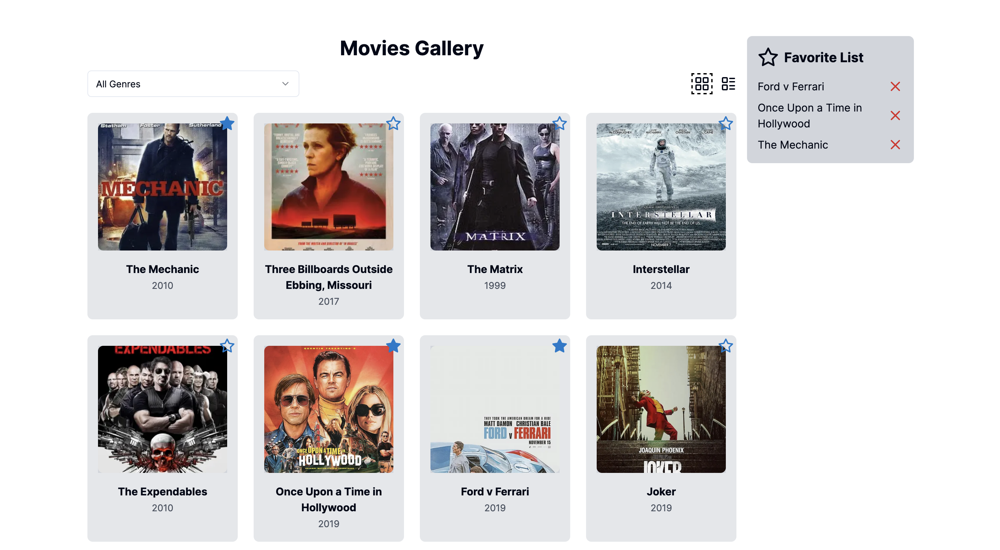

# Movies Gallery



This is a Movies Gallery project that allows users to view a list of movies, add them to their favorites and view details of each movie displayed in a modal.

## Technologies

The project uses Next.js, although it is not necessary and it would be fine to use React. For styling TailwindCSS and shadcn/ui are used.

For handling the favorite movies data, the project uses React Context and Local Storage. Somewhat new **useSyncExternalStore** hook is used to sync the context state with the local storage (for view state persistence, _as it must be immutable data (primitive types), you can't use arrays and store favoriteMovies in same fashion_).

## Running the project

Run the development server:

```bash
npm run dev
# or
yarn dev
# or
pnpm dev
# or
bun dev
```

Open [http://localhost:3000](http://localhost:3000) with your browser to see the result.
